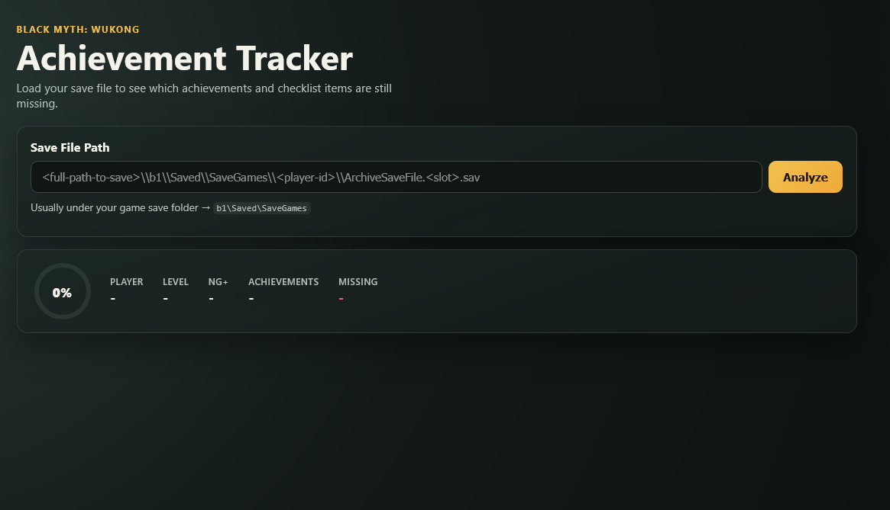

# Black Myth: Wukong Achievement Tracker

This repo contains a save-file tracker for Black Myth: Wukong.



- `bmw_web`: the recommended browser UI for checking achievement progress
- `bmw_probe`: an optional CLI that writes JSON and Markdown reports
- `bmw.sln`: root solution that includes both projects
- `vendor/blackwukong-dlls/`: vendored decoder/runtime DLLs required by both projects

## Quickstart

```powershell
dotnet build .\bmw.sln
dotnet run --project ".\\bmw_web\\bmw_web.csproj"
```

Then:

1. Open the local URL printed in the terminal.
2. Choose your `.sav` file in the browser.
3. Click `Analyze`.
4. Review the overview, missing item tracker, and remaining achievements.

## What It Does

The tracker reads a `.sav` file, decodes the achievement data, and builds a player-facing checklist.

- Shows overall achievement progress from the save
- Highlights unfinished achievements
- For tracked collection achievements, shows the exact missing items still absent from the decoded save
- Uses English item and achievement names in the web UI

Tracked collection checklists currently include achievements such as curios, soaks, seeds, drinks, gourds, meditation spots, spells, medicine formulas, vessels, armor pieces, and weapons.

## Web App

Run the web app:

```powershell
dotnet run --project .\bmw_web\bmw_web.csproj
```

Then open the local URL printed in the terminal.

In the UI:

1. Choose your save file from disk.
2. Click `Analyze`.
3. Review:
   - the overview panel
   - the missing item tracker
   - the remaining achievements list
   - the full achievement table

Look for save files like:

```text
<game-install-or-save-root>\b1\Saved\SaveGames\<player-id>\ArchiveSaveFile.<slot>.sav
```

## Docker

Build the container image from the repo root:

```powershell
docker build -t bmw-web .
```

Run the containerized web app:

```powershell
docker run --rm -p 8080:8080 bmw-web
```

Then open `http://localhost:8080` and upload your `.sav` file in the browser. No save-path volume mount is required because the web UI uploads the file directly.

## CLI

Run the CLI directly:

```powershell
dotnet run --project .\bmw_probe\bmw_probe.csproj -- --save "<full-path-to-save>" --out ".\bmw_probe\output"
```

Or use the helper script:

```powershell
.\run-planner.ps1 -SavePath "<full-path-to-save>" -OutDir ".\bmw_probe\output"
```

CLI output files:

- `bmw_probe/output/achievement-plan.json`
- `bmw_probe/output/achievement-plan.md`

## Build

Build both projects from the solution root:

```powershell
dotnet build .\bmw.sln
```

## Vendored Dependency

This repo vendors the decoder DLL set used to read Black Myth: Wukong saves.

- Local path: `vendor/blackwukong-dlls/`
- Upstream reference: `https://github.com/BlameTwo/BlackWukongSaveEditer`

Only the required DLLs are kept in-repo. The full upstream project is not needed to build this solution.
