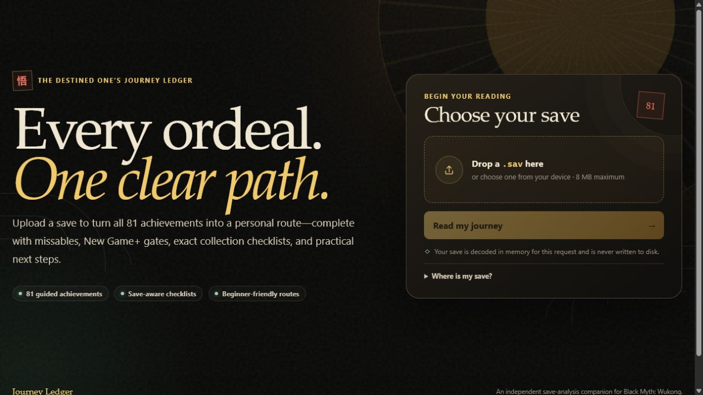

# Black Myth: Wukong Achievement Tracker

This repo contains a private, browser-based save tracker and beginner-friendly achievement guide for Black Myth: Wukong.



- `bmw_web`: the recommended browser UI for checking achievement progress
- `bmw_probe`: an optional CLI that writes JSON and Markdown reports
- `bmw.sln`: root solution that includes both projects
- `vendor/blackwukong-dlls/`: vendored decoder/runtime DLLs required by both projects

## Quickstart

Install a stable .NET 10 SDK, then run:

```powershell
dotnet build .\bmw.sln
dotnet run --project ".\\bmw_web\\bmw_web.csproj"
```

Then:

1. Open the local URL printed in the terminal.
2. Choose your `.sav` file in the browser.
3. Click `Analyze`.
4. Review the next recommended steps, missing item tracker, and complete 81-achievement guide.

## What It Does

The tracker reads a browser-uploaded `.sav` file in memory, decodes the achievement and inventory data, and builds a player-facing checklist. The web app never needs a server-local path and does not write the uploaded save to disk.

- Always renders the canonical set of all 81 platform achievements, including entries omitted by early-game saves
- Shows completion status, plain-English requirements, chapter, category, prerequisites, missable warnings, New Game+ notes, and step-by-step routes
- Recommends three useful next achievements based on current chapter and remaining work
- Shows exact decoded missing-item checklists where the save exposes reliable ownership or requirement IDs
- Supports full-text search across achievement names, requirements, route steps, collectible names, and acquisition hints
- Includes status, category, and chapter filters plus an optional spoiler reveal
- Uses a responsive ink, parchment, jade, and cinnabar interface designed for desktop and mobile

Tracked collection checklists include 36 curios, 20 weapons, 71 armor pieces, 54 spirits, 27 soaks, 24 meditation spots, 14 formulas, 12 seed requirements, 10 transformations, 9 collectible gourds, 8 collectible drinks, 7 spells, 4 vessels, journal groups, and celestial-medicine progress. Some automatic/story unlocks are explained in the achievement guide rather than represented as separate runtime item IDs.

## Web App

Run the web app:

```powershell
dotnet run --project .\bmw_web\bmw_web.csproj
```

Then open the local URL printed in the terminal.

In the UI:

1. Drop a `.sav` file onto the upload panel or choose it from disk.
2. Click `Analyze`.
3. Review:
   - the overview panel
   - the three recommended next steps
   - the missing item tracker
   - the searchable and filterable 81-achievement library
   - detailed requirements, routes, prerequisites, and missable warnings

Uploads are limited to 4 MB so the complete multipart request stays below common managed-function request limits. Analysis happens in memory and the response is marked `no-store`.

Look for save files like:

```text
<game-install-or-save-root>\b1\Saved\SaveGames\<player-id>\ArchiveSaveFile.<slot>.sav
```

## Docker

Build the container image from the repo root:

```powershell
docker build -t bmw-web .
```

Run the containerized web app:

```powershell
docker run --rm -p 8080:8080 bmw-web
```

Then open `http://localhost:8080` and upload your `.sav` file in the browser. No save-path volume mount is required because the web UI uploads the file directly.

## Vercel

Vercel deploys the web app as a container-backed Function from `Dockerfile.vercel`. Keep the Vercel project root at the repository root so the container build can include both `bmw_web/` and `vendor/blackwukong-dlls/`.

Install and authenticate the Vercel CLI:

```powershell
npm install --global vercel
vercel login
```

Link or create the project at the repository root and ensure the framework preset is `Container`. If Vercel reports the preset as `Other`, set it explicitly before deploying:

```powershell
vercel link
vercel project update --framework container
```

Create and verify a preview deployment from the repository root:

```powershell
vercel deploy --logs
```

After testing the preview URL and `/api/health`, deploy to production:

```powershell
vercel deploy --prod --logs
```

The Vercel container listens on the platform-provided `PORT`. The direct upload limit is 4 MB because Vercel Functions reject request bodies larger than 4.5 MB.

## CLI

Run the CLI directly:

```powershell
dotnet run --project .\bmw_probe\bmw_probe.csproj -- --save "<full-path-to-save>" --out ".\bmw_probe\output"
```

Or use the helper script:

```powershell
.\run-planner.ps1 -SavePath "<full-path-to-save>" -OutDir ".\bmw_probe\output"
```

CLI output files:

- `bmw_probe/output/achievement-plan.json`
- `bmw_probe/output/achievement-plan.md`

## Build

Build both projects from the solution root:

```powershell
dotnet build .\bmw.sln
```

## Vendored Dependency

This repo vendors the decoder DLL set used to read Black Myth: Wukong saves.

- Local path: `vendor/blackwukong-dlls/`
- Upstream reference: `https://github.com/BlameTwo/BlackWukongSaveEditer`

Only the required DLLs are kept in-repo. The full upstream project is not needed to build this solution.
